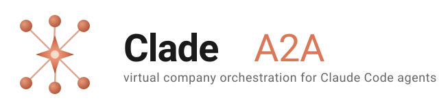

<p align="center">
  
</p>

<p align="center">
  <strong>Build your virtual company.</strong> Orchestrate N Claude Code agents with distinct roles, coordinate through a CEO peer, delegate tasks, broadcast to teams. Secure HMAC-signed A2A communication through a central relay.
</p>

<p align="center">
  <a href="#quick-start--virtual-company-in-60-seconds"><strong>Quick start</strong></a> ·
  <a href="examples/virtual-company/"><strong>Example company</strong></a> ·
  <a href="a2a-protocol.md"><strong>Protocol spec</strong></a> ·
  <a href="#mcp-tools--what-claude-sees"><strong>MCP tools</strong></a>
</p>

---

**Status:** v1.12.0 — virtual company orchestration (broadcast, teams, async tasks, presence, role-aware prompts) + `--quickstart` one-shot bootstrap + `extra_add_dirs` filesystem access config + full web peer management (add / edit / remove + teams) at `/setup/<token>`. Production-ready for LAN/VPN; public deploy via Caddy + TLS.

---

## What you build with this tool

Not "secure message bus" — that's just the lower layer. **The real use case:** a virtual company where each agent has a role, and you (as CEO) coordinate them. Concrete examples:

- **Mini dev shop:** you = CEO, agent_1 = backend dev, agent_2 = frontend dev, agent_3 = QA. Delegate tasks, they work in parallel, report status back.
- **Research team:** you = lead researcher, N agents with different domain expertise (NLP, vision, RL). Broadcast a question, collect N perspectives.
- **Content pipeline:** writer agent, editor agent, fact-checker agent, publisher agent. Sequential delegation through tasks.
- **Support tier:** triage agent takes everything, escalates to specialists via `clade_task(to=<specialist>, brief=...)`.

The main API that enables this:

```
clade_peers()                        ← who is online right now
clade_broadcast(to_team, content)    ← one message, N peers in parallel
clade_task(to, brief, deadline)      ← async delegation, returns task_id
clade_task_status(task_id)           ← check progress
clade_task_list(filter, status)      ← my backlog (sent + received)
clade_message(to, content, ...)      ← direct ask or fire-and-forget (1:1)
```

**What it is NOT:** a Slack replacement for humans. Latency is 5–90s per reply due to LLM inference + polling.

---

## Quick start — virtual company in 60 seconds

Two paths, pick what fits:

### Path 1 — fully from the web (recommended for custom companies)

```bash
git clone https://github.com/inter-coder/clade-a2a.git && cd clade-a2a
uv venv && uv pip install -e .

./scripts/start-setup-server.sh
# Open http://<your-host>:8000/ in a browser
```

In the form:
1. (Optional) **Load virtual-company template** — pre-fills CEO + frontend + backend + qa + engineering team
2. Add / edit / remove peers; set roles, teams, `extra_add_dirs`
3. **Generate Setup** → redirected to the result page
4. On the result page, copy the **"Install all peers on this machine"** one-liner:
   ```bash
   curl -fsSL http://<your-host>:8000/setup/<token>/install-all | bash
   ```
   Run it once — every peer's yaml + scripts + workdir are written to `~/clade-agent/`.
5. Start the daemons (one terminal per peer):
   ```bash
   ~/clade-agent/start-frontend.sh --yolo
   ~/clade-agent/start-backend.sh  --yolo
   ~/clade-agent/start-qa.sh       --yolo
   ```
6. Open a coordinator session (the CEO, or any peer you want to drive):
   ```bash
   ~/clade-agent/chat-ceo.sh
   ```

After that the result page is your **management console** — add / edit / remove peers, edit teams, all in-browser (changes hot-reload via `config_watcher_loop` within ~5s, no daemon restarts).

### Path 2 — single-command bootstrap (default 4-peer template)

If you just want the standard CEO + frontend + backend + qa template without touching the form:

```bash
./scripts/start-setup-server.sh --quickstart
```

Equivalent to Path 1 with the template loaded and install-all run automatically. Skips the browser step.

### Path 3 — import an AI Team Framework project (v1.13.0)

If you already have a project scaffolded by the [AI Team Framework wizard](https://github.com/dusankrstic-cpu/ai-team-framework) (`.ai-team-config.yml` + `docs/TEAM/*.md` in the project root), Clade can adopt it in one shot:

1. From the setup-server form, use the green **Import AI Team Framework project** card — paste the absolute project path and click Import.
2. Or hit the REST endpoint directly:

   ```bash
   curl -X POST http://<host>:8000/api/setup/import-aitf \
     -H 'Content-Type: application/json' \
     -d '{"project_path": "/absolute/path/to/your-aitf-project", "relay_url_host": "<lan-ip>"}'
   ```

What you get:

| AITF role | → Clade peer | Team membership |
|---|---|---|
| Project Director | `pd` | `aitf_team` |
| Development Director | `dd` | `aitf_team`, `engineering` |
| Development Team | `team` | `aitf_team`, `engineering` |
| Documentation Optimizer | `doc` *(only if `doc_optimizer_enabled: true`)* | `aitf_team` |

Each peer's role prompt is the **verbatim content** of the matching AITF template (`docs/TEAM/PROJECT_DIRECTOR.md`, etc.). Each peer's `extra_add_dirs` includes the absolute project path, so the daemon-spawned Claude can read AND write the AITF document substrate (`DIRECTIVES/`, `REPORTS/`, `TODO.md`, `DECISIONS.md`, `ARCHIVE/`).

**Phase B (v1.14.0) — self-driving scribe:** the `doc` peer is auto-configured with a `scribe:` block (`enabled: true`, `interval_minutes: 60`, `max_rounds_per_day: 24`, watches the imported project root). Its daemon runs a fifth side-loop that wakes every hour, compares `git rev-parse HEAD` of the repo against persisted state, and **only spawns Claude when there are new commits**. Idle days cost zero tokens.

**Phase C (v1.15.0) — orchestrator replacement:** PD / DD / Team also get `scribe:` blocks with role-specific `round_prompt` overrides. Each role wakes on new commits and decides whether it has work:

| Role | Interval | Wakes to... |
|---|---|---|
| `pd` | 30min | React to verdicted REPORTS; update `PROJECT_STATUS.md`; issue next directive if phase complete |
| `dd` | 15min | Break new `DIRECTIVES/*` into `TODO.md` items; verdict any new `REPORTS/*` |
| `team` | 30min | Pick first unchecked `TODO.md` task in current phase; implement; write a report |
| `doc` | 60min | Default Phase B documentation-curator round (update summaries, nudge quiet peers) |

If nothing in the new commits is relevant to a role's responsibilities, that role's prompt instructs it to do nothing this round (silence is the right answer). Effectively replaces AITF's human-as-dispatcher (`./start_role.sh <role>`) and `scripts/orchestrator.sh` with self-driving daemons. The human still owns scope — set strategic direction by writing to PD's `clade_inbox` or by hand-editing `docs/TEAM/DIRECTIVES/`.

### Managing the company later

Open the result page (`http://<host>:8000/setup/<project_token>`) — it's a
full management UI as of v1.12.0:

- **Add a new peer** card: fill peer_id / display name / role / teams / extra_add_dirs → Add
- Each peer card has **Edit** (display name, role, extra_add_dirs) and **Remove** buttons
- **Teams** card: add / remove members per team, create / delete teams

All operations are surgical — existing daemons hot-reload via `config_watcher_loop` within ~5s (peer allowlist + teams). Only role / display_name / extra_add_dirs changes for a peer's *own* config need that peer's daemon restarted (the field changes are flagged in the response).

REST endpoints under the hood (all under `/api/setup/<project_token>/`):

| Method | Path | Purpose |
|---|---|---|
| POST | `peers` | Add new peer |
| PATCH | `peers/{peer_id}` | Edit role / display name / extra_add_dirs |
| DELETE | `peers/{peer_id}` | Remove peer (drops bearer, scrubs from teams, deletes files, kills daemon if running) |
| GET | `teams` | Current teams structure |
| PUT | `teams` | Replace teams structure |

### CLI alternative

Same operations from the terminal:

```bash
./scripts/add-peer.sh designer "Mira — UX designer" \
    "You are Mira, UX designer. Specialty: Figma, design systems." \
    --team everyone --team engineering
```

What it does (atomically):
- Generates HMAC pair-secrets for the new peer × every existing peer
- Updates every existing `<peer>.yaml` to add the newcomer (daemons hot-reload via `config_watcher_loop` within ~5s)
- Writes `~/clade-agent/designer.yaml`, `start-designer.sh`, `chat-designer.sh`, `workdir-designer/`
- Appends to `tokens.json`, calls relay's `POST /admin/reload-tokens` so the new bearer is recognized
- Calls setup-server's `POST /admin/reload` so the web UI picks up the new peer

Only the new peer's daemon needs to be started:
```bash
~/clade-agent/start-designer.sh --yolo
```

### Alternative: pre-built example via `bootstrap.sh`

For maximum control (custom relay host, manual daemon launches, etc.):

```bash
cd examples/virtual-company
./bootstrap.sh           # generates tokens.json + 4 yamls + mcp-ceo.json
../../.venv/bin/clade-relay --tokens $(pwd)/tokens.json --host 127.0.0.1 --port 7777
# Then start daemons + CEO chat as documented in examples/virtual-company/README.md
```

In the CEO prompt, talk naturally:

```
> Who is in the company right now?
   → clade_peers() — table with roles and online status

> Send the engineering team: stand-up in 10 minutes
   → clade_broadcast(to_team="engineering", content="stand-up in 10 minutes")

> Ask backend and frontend in parallel: how long for feature X?
   → clade_broadcast(to=["backend","frontend"], content="...", expect_reply=True)

> Delegate to backend: refactor the login API endpoint
   → clade_task(to="backend", brief="refactor login API endpoint")
   → returns task_id; backend works as long as it needs

> What tasks are currently in flight?
   → clade_task_list(filter="sent", status="in_progress")
```

Full scenarios: [`examples/virtual-company/README.md`](examples/virtual-company/README.md).

---

## Alternative setup — web wizard (for real deployments)

For a company with peers on different machines:

```bash
./scripts/start-setup-server.sh
# Open http://127.0.0.1:8000/ (or LAN IP)
# Form: add peers + add teams + Generate Setup
```

The setup server returns a per-peer install URL. Each peer (even on another machine) runs:

```bash
curl -fsSL http://<setup-host>:8000/agent/<token>/install | bash
~/clade-agent/start.sh --yolo            # daemon
~/clade-agent/chat.sh                    # interactive Claude session
```

Details: [`scripts/start-setup-server.sh`](scripts/start-setup-server.sh) and the in-browser instructions.

---

## Mental model

```
CEO machine (you hold this peer interactively)
  ┌─────────────────────────────────────┐
  │ Claude Code (interactive)           │
  │   ↓ MCP stdio                       │
  │ clade-agent (peer 'ceo')            │
  │   ↓ HTTPS + Bearer + HMAC           │
  └─────────┬───────────────────────────┘
            │
       ┌────▼────────────────┐
       │     Clade Relay     │  ← FastAPI dispatcher + presence tracker
       │ (presence, audit,   │     + back-pressure 503 + Redis store
       │  pending_asks)      │
       └────┬────────────────┘
            │
   ┌────────┼────────┬───────────────┐
   │        │        │               │
   ▼        ▼        ▼               ▼
┌──────┐ ┌──────┐ ┌──────┐    Employee machines (each runs a daemon)
│front │ │back  │ │ qa   │    Daemon polls relay, auto-answers asks,
│-end  │ │-end  │ │      │    auto-records tasks into SQLite, sends
│daemon│ │daemon│ │daemon│    presence heartbeat every 15s.
└──────┘ └──────┘ └──────┘
```

Each peer has two layers:
- **Daemon** (always running) — polls inbox, auto-answers asks via `claude --print --append-system-prompt "<role>"`, records tasks into local SQLite, sends presence heartbeat.
- **Interactive Claude** (on demand) — when YOU want to initiate messages manually. The CEO keeps this open all the time.

---

## MCP tools — what Claude sees

After MCP setup, every peer has 10 `clade_*` tools (v1.9.0):

### Communication

| Tool | Purpose |
|---|---|
| `clade_message(to, content, expect_reply=False, timeout_s=90, thread_id=None)` | Direct 1:1 message. `expect_reply=True` = synchronous ask. |
| `clade_broadcast(content, to=[...] \| to_team="...", expect_reply=False)` | N peers in parallel. **v1.9.0** |
| `clade_reply(correlation_id, response, to)` | Manual reply (daemon usually auto-replies). |
| `clade_inbox(max_items=50)` | Drain inbox; returns busy when daemon is running. |

### Discovery / awareness

| Tool | Purpose |
|---|---|
| `clade_peers()` | Who is online right now (heartbeat <30s). Returns roles + secs_ago. **v1.8.0** |

### Task delegation

| Tool | Purpose |
|---|---|
| `clade_task(to, brief, deadline_ts_ms=None)` | Async delegate. Returns `task_id` immediately. **v1.9.0** |
| `clade_task_update(task_id, status, result)` | Assignee reports back to delegator. `status` ∈ pending/in_progress/done/failed/cancelled. **v1.9.0** |
| `clade_task_status(task_id)` | Current status from local DB. **v1.9.0** |
| `clade_task_list(filter="all"\|"sent"\|"received", status=None)` | Task list. **v1.9.0** |

### Diagnostics

| Tool | Purpose |
|---|---|
| `clade_outbox_status()` | Pending message stats + force flush. |

Deprecated: `clade_send`, `clade_ask` — use `clade_message`.

---

## Configuration

### Per-peer YAML (v1.10.2)

```yaml
my_id: ceo
name: "CEO"
role: |
  You are the CEO of the virtual company. You coordinate, delegate, broadcast.
  Before delegating, check who is online (clade_peers).
relay_url: http://192.168.1.91:7777
bearer_token: <urlsafe-32>
peers:
  frontend:
    secret: <hex-64>
    name: "Ana — Frontend dev"
    role: "React/TypeScript expert"
  backend:
    secret: <hex-64>
    name: "Bob — Backend dev"
    role: "Python/FastAPI/Postgres expert"
  qa:
    secret: <hex-64>
    name: "Cveta — QA"
    role: "Test automation, manual QA"
teams:                              # v1.9.0
  engineering: [frontend, backend, qa]
  everyone:    [frontend, backend, qa]
audit_db: ~/.clade/ceo-audit.db
extra_add_dirs:                     # v1.10.2
  - ~/projects/myapp
  - /var/www
```

All peers have the **same** teams definitions (bootstrap.sh and setup-server guarantee this). File permissions 0600.

**`extra_add_dirs`** (v1.10.2) — paths the daemon-spawned Claude is allowed
to read outside its workdir. Without this, Claude is locked to its workdir +
auto-included dirs (config dir, audit_db parent, `/opt/clade-a2a`). With it,
you can permanently grant access to project roots, data directories, etc.
Non-existent paths are skipped with a warning. The daemon reads the yaml at
startup, so edits take effect on the next `start-<peer>.sh`.

### Relay tokens.json

```json
{
  "<ceo-bearer>":      "ceo",
  "<frontend-bearer>": "frontend",
  "<backend-bearer>":  "backend",
  "<qa-bearer>":       "qa"
}
```

Permissions 0600. NEVER commit to git (`.gitignore` blocks it).

---

## Patterns for a virtual company

### 1. CEO coordinator pattern (recommended)

CEO peer = you, others = daemons. The CEO holds an interactive Claude session, types in natural language, and Claude maps to `clade_*`. Daemons auto-process ask and task messages.

**Benefit:** you don't have to type code. "Tell backend to ..." → automatic.

### 2. Async task delegation

When a task takes longer than 90s (refactor, presentation, research):

```
CEO: clade_task(to="backend", brief="Refactor login flow", deadline_ts_ms=...)
     → returns {task_id: "abc-123", status: "pending"}

Backend daemon: receives task in inbox, sees _task flag → INSERT into tasks table.
                Backend Claude (when launched interactively) sees it in clade_task_list.

Backend: clade_task_update("abc-123", status="in_progress")
         → CEO daemon receives _task_update → UPDATE local DB

Backend: clade_task_update("abc-123", status="done", result="PR #42")
         → CEO sees it in clade_task_list(status="done")
```

### 3. Broadcast for status / announcements

```
CEO: clade_broadcast(to_team="everyone", content="deploy v3.2.0 at 14:00")
     → 3 parallel fire-and-forget messages

CEO: clade_broadcast(to_team="engineering", content="how long?", expect_reply=True)
     → 3 parallel asks; CEO gets 3 answers in a single results dict
```

### 4. Specialist delegation

When the CEO doesn't know who would know:

```
CEO: clade_peers()  → sees roles
CEO: clade_message(to="qa", content="what are test strategies for the auth flow?", expect_reply=True)
```

Or peers between themselves (frontend asks backend mid-task):

```
Frontend Claude while working: clade_message(to="backend", content="what are the /api/login error codes?", expect_reply=True)
```

---

## Reference

### Relay REST endpoints (v1.11.0)

| Method | Path | Auth | Purpose |
|---|---|---|---|
| GET | `/health` | none | Liveness + online_agents + pending_by_peer |
| POST | `/send` | Bearer | Fire-and-forget |
| POST | `/ask` | Bearer | Synchronous ask (server blocks until reply or timeout) |
| POST | `/reply` | Bearer | Reply to a pending ask |
| GET | `/inbox/{agent_id}` | Bearer | Drain your own inbox |
| GET | `/audit` | Bearer | Audit log (last N entries) |
| POST | `/presence` | Bearer | Heartbeat — daemon calls every 15s **(v1.8.0)** |
| GET | `/presence` | Bearer | Snapshot of who is online + secs_ago **(v1.8.0)** |
| POST | `/admin/reload-tokens` | Bearer | Re-read tokens.json from disk **(v1.11.0)** |
| GET | `/ui/audit` | none | Static HTML viewer |

### Setup-server REST endpoints (v1.12.x)

Read by the web UI; also callable directly for scripting.

| Method | Path | Purpose |
|---|---|---|
| GET | `/` | Setup form (HTML) |
| POST | `/api/setup` | Generate a new setup project (returns 303 → result page) |
| GET | `/setup/{token}` | Result + management page (HTML) |
| GET | `/setup/{token}/status` | Live status JSON (relay alive, presence, pending) |
| GET | `/setup/{token}/install-all` | One-shot bash script that installs every peer locally **(v1.12.1)** |
| GET | `/agent/{download_token}/install` | Per-peer install bash script |
| GET | `/agent/{download_token}/{config\|start\|chat\|mcp-config}` | Per-peer artifacts |
| POST | `/api/setup/{token}/peers` | Add a new peer **(v1.12.0)** |
| PATCH | `/api/setup/{token}/peers/{peer_id}` | Edit role / display_name / extra_add_dirs **(v1.12.0)** |
| DELETE | `/api/setup/{token}/peers/{peer_id}` | Remove peer (scrubs + kills daemon) **(v1.12.0)** |
| GET | `/api/setup/{token}/teams` | Read current teams structure **(v1.12.0)** |
| PUT | `/api/setup/{token}/teams` | Replace teams structure **(v1.12.0)** |
| POST | `/api/setup/import-aitf` | Import an [AI Team Framework](https://github.com/dusankrstic-cpu/ai-team-framework) project as a Clade setup **(v1.13.0)** |
| POST | `/admin/reload` | Re-read setups from disk into in-memory state **(v1.11.0)** |

### Protocol

Single source of truth: [`a2a-protocol.md`](a2a-protocol.md) (v1.15.x). Read it before changing the envelope schema or HMAC.

### Repo structure

```
clade-a2a/
├── README.md                    ← this file
├── a2a-protocol.md              ← protocol SSOT (v1.9.0)
├── ROADMAP.md                   ← phase tracking
├── assets/
│   ├── logo.svg                 ← square logo (256x256)
│   └── logo-wide.svg            ← horizontal logo + wordmark
├── examples/
│   └── virtual-company/         ← 4-peer demo company (CEO + 3 employees) — start here
│       ├── README.md            ← scenarios
│       └── bootstrap.sh         ← generates all secrets
├── relay/                       ← FastAPI dispatcher + presence + Redis store
├── agent/
│   ├── main.py                  ← stdio MCP server, 10 tools
│   ├── daemon.py                ← long-running poller + auto-responder
│   └── outbox.py                ← SQLite outbox + backoff
├── clade_cli/
│   ├── init.py                  ← clade-init bootstrap CLI
│   ├── setup_server.py          ← web setup wizard (FastAPI)
│   └── templates/               ← chat.sh, start.sh, install.sh, index.html, result.html
├── scripts/
│   ├── start-setup-server.sh
│   ├── clade-cleanup.sh         ← kill daemons + relay + workdirs
│   └── test.sh
├── tests/                       ← pytest suite (54+ tests)
├── deploy/                      ← Docker Compose + Caddy + systemd
└── pyproject.toml
```

### Limits

| Setting | Default | Override |
|---|---|---|
| Nonce TTL | 300s | `relay/main.py:NONCE_TTL_S` |
| Timestamp skew | 300_000ms | `relay/main.py:TS_SKEW_MS` |
| Inbox max per agent | 1000 | `relay/main.py:INBOX_MAX` |
| Max pending asks per peer | 4 | `CLADE_RELAY_MAX_PENDING_PER_PEER` env (v1.6.0+) |
| Ask default timeout | 90s | per-call argument |
| Presence TTL | 35s | `CLADE_RELAY_PRESENCE_TTL_S` env (v1.8.0+) |
| Presence heartbeat | 15s | `CLADE_DAEMON_PRESENCE_S` env (v1.8.0+) |
| Daemon concurrency | 2 | `CLADE_DAEMON_CONCURRENCY` env (v1.4.8+) |

### Security model

| Threat | Mitigation |
|---|---|
| Outsider | Bearer auth wall (401) |
| Token leak | 0600 file perms, rotation, never-log |
| Compromised relay | End-to-end HMAC — relay can't forge |
| Compromised peer | Audit trail, token revoke |
| MITM | TLS (public) or VPN (LAN) |
| Replay | Nonce + ts ±5min |
| Prompt injection from a peer | `_instruction` field in clade_inbox + system prompt discipline |

**Trust boundary:** cooperative peers. If you don't trust someone — don't add them to the `peers:` allowlist.

---

## Troubleshooting

**`clade_peers` shows a peer as offline even though its daemon is "running"** — probably the daemon is from v1.7.x or earlier (no presence_loop). Upgrade and restart the daemon. After 15s it must be online.

**`clade_broadcast` returns `failed > 0`** — at least one target peer is offline or unknown. The `results` dict shows the per-peer error.

**`clade_task` sent but `clade_task_status` says the task_id is not in DB** — that's the delegator side; the task_id exists from the moment it's sent. If you get an error, you've likely mis-typed the task_id.

**Assignee doesn't see `clade_task_list(filter="received")` even though CEO delegated** — the daemon must be running on the assignee machine when the task arrives. Otherwise the task sits in the relay inbox and waits. When the daemon starts, it drains the inbox and writes to tasks.

**Send queued, never flushes** — relay unreachable. Check: `curl http://<relay>:7777/health`. Status: `clade_outbox_status`.

**Tampered HMAC in the rejected list** — the shared secret doesn't match between peers. If you use bootstrap.sh / setup-server, this can't happen. If you edit YAML by hand — verify that `alice.yaml.peers.bob.secret == bob.yaml.peers.alice.secret`.

---

## Dev commands

```bash
# Run tests
./scripts/test.sh

# Single test
.venv/bin/python -m pytest tests/test_agent_e2e.py::test_clade_broadcast_to_list_parallel_send -v

# Build wheel
.venv/bin/python -m build

# Cleanup orphan daemons / relay / workdirs / setup-server
./scripts/clade-cleanup.sh
./scripts/clade-cleanup.sh --dry-run
./scripts/clade-cleanup.sh --include-relay --include-setups
```

No linter / type-checker config. Before commit, just run `./scripts/test.sh`.

### Cleanup orphan state

```bash
./scripts/clade-cleanup.sh                              # kill daemons + remove locks/workdirs
./scripts/clade-cleanup.sh --include-relay --include-setups   # also kill relay + wipe ~/.clade/setup-server
./scripts/clade-cleanup.sh --prune-audit 7              # delete audit/thread_history older than 7 days + VACUUM
```

Or just rerun `./scripts/start-setup-server.sh` — it resets everything
(daemons, locks, workdirs, setup-server data) on every launch by default.
Add `--deep` to also wipe `~/.clade/*-audit.db` and `~/clade-agent/`.

---

## Status & roadmap

| Version | What | Status |
|---|---|---|
| v1.0.0 | `clade_message` unification, file lock | ✓ |
| v1.1.0 | Thread persistence (`_thread_id` + SQLite) | ✓ |
| v1.2.0 | Clarify-back, outbox monitor, minimal headless | ✓ |
| v1.3.0 | Name + role per peer (system prompt) | ✓ |
| v1.4.x | UX iterations, setup-server, parallel poll, humanized errors | ✓ |
| v1.6.0 | Cancel protocol + relay back-pressure | ✓ |
| v1.7.0 | Hot-reload peer allowlist, log rotation, audit prune | ✓ |
| v1.8.0 | Presence layer (`clade_peers`, /presence endpoint) | ✓ |
| v1.9.0 | Virtual company: broadcast, teams, async tasks | ✓ |
| v1.10.0 | Verbosity discipline + MCP auto-trust + install hard-sync | ✓ |
| v1.10.2 | `extra_add_dirs` config + `--quickstart` flag | ✓ |
| v1.11.0 | `clade-add-peer` surgical peer addition + relay/setup-server reload endpoints | ✓ |
| **v1.12.0** | **Full web peer management (add / edit / remove + teams) at `/setup/<token>`** | ✓ |
| v2.x | Persistent task scheduler, CEO dashboard, transparency mode | future |

Details: [`a2a-protocol.md` §11](a2a-protocol.md).

---

## License

MIT.

## Author

Dušan Krstić (Symappsys d.o.o.) with Claude Code assistance.
